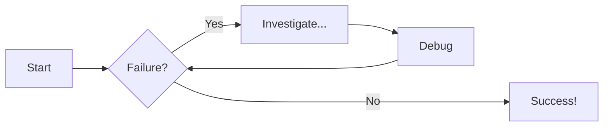
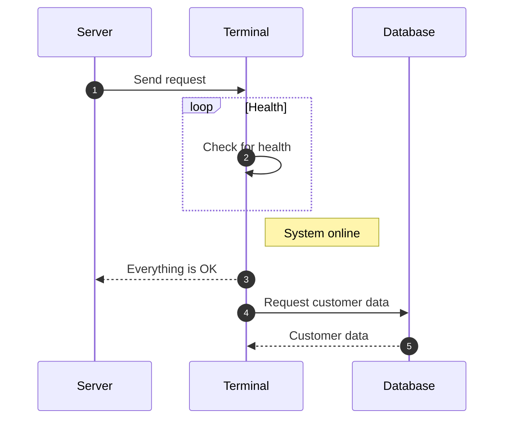
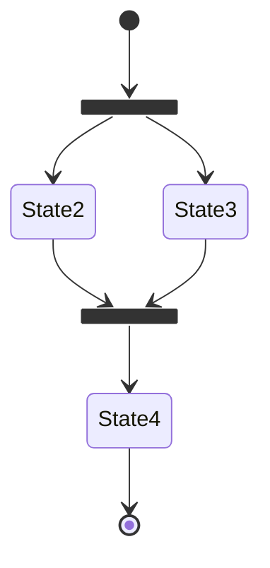

# Diagram Examples

## Flowcharts

```mermaid
graph LR
  A[Start] --> B{Failure?};
  B -->|Yes| C[Investigate...];
  C --> D[Debug];
  D --> B;
  B ---->|No| E[Success!];
```

## Sequence Diagrams

```mermaid
sequenceDiagram
  autonumber
  Server->>Terminal: Send request
  loop Health
      Terminal->>Terminal: Check for health
  end
  Note right of Terminal: System online
  Terminal-->>Server: Everything is OK
  Terminal->>Database: Request customer data
  Database-->>Terminal: Customer data
```

``` mermaid
stateDiagram-v2
  state fork_state <<fork>>
    [*] --> fork_state
    fork_state --> State2
    fork_state --> State3

    state join_state <<join>>
    State2 --> join_state
    State3 --> join_state
    join_state --> State4
    State4 --> [*]
```